   
  <h1>Rishi</h1>
  <h3>Software Engineer &bull; Full Stack Developer</h3>
  

    I build polished web experiences, practical automation, and developer tools
    with a focus on clarity, performance, and thoughtful details.
  

  

    <a href="mailto:sairishitsunku@gmail.com">Contact</a>
    &nbsp;&middot;&nbsp;
    <a href="https://github.com/Rishit-07">GitHub</a>
    &nbsp;&middot;&nbsp;
    <a href="https://linkedin.com/in/Sai%20Rishit%20Sunku">LinkedIn</a>
  

   

---

## About

<table>
  <tr>
    <td width="50%" valign="top">
      <h3>Current Focus</h3>
      

        Designing refined GitHub profile systems with Python automation,
        animated SVGs, and clean visual storytelling.
      

    </td>
    <td width="50%" valign="top">
      <h3>Tech Stack</h3>
      

        React, Node.js, Express, MongoDB, Python, OpenCV, GitHub Actions.
      

    </td>
  </tr>
  <tr>
    <td width="50%" valign="top">
      <h3>Learning</h3>
      

        Better product design, scalable backend patterns, image processing,
        and polished frontend motion.
      

    </td>
    <td width="50%" valign="top">
      <h3>Open Source</h3>
      

        Small tools, profile automation, creative developer experiences,
        and projects that make everyday workflows smoother.
      

    </td>
  </tr>
</table>

---

## Featured Projects

<table>
  <tr>
    <td width="50%" valign="top">
      <h3>Qurate</h3>
      

        A featured project focused on building a polished, practical product experience.
      

      
<strong>Full Stack &bull; Web &bull; Product</strong>

      
<a href="https://github.com/Rishit-07/Qurate">View on GitHub</a>

    </td>
    <td width="50%" valign="top">
      <h3>Socials</h3>
      

        A featured project designed around modern social and profile experiences.
      

      
<strong>Full Stack &bull; Web &bull; Social</strong>

      
<a href="https://github.com/Rishit-07/Socials">View on GitHub</a>

    </td>
  </tr>
</table>

---

## GitHub Activity

  

    <strong>Contribution activity, updated daily.</strong> 
    Rendered locally from this repository's existing SVG generator.
  

  

---

## Skills

<table>
  <tr>
    <td width="25%" valign="top">
      <h3>Frontend</h3>
      
React

      
JavaScript

      
HTML

      
CSS

    </td>
    <td width="25%" valign="top">
      <h3>Backend</h3>
      
Node.js

      
Express

      
MongoDB

      
REST APIs

    </td>
    <td width="25%" valign="top">
      <h3>Languages</h3>
      
Python

      
Java

      
JavaScript

      
SQL

    </td>
    <td width="25%" valign="top">
      <h3>Tools</h3>
      
Git

      
GitHub Actions

      
VS Code

      
Postman

    </td>
  </tr>
</table>

---

## Contact

  <a href="mailto:sairishitsunku@gmail.com">Email</a>
  &nbsp;&middot;&nbsp;
  <a href="https://linkedin.com/in/Sai%20Rishit%20Sunku">LinkedIn</a>
  &nbsp;&middot;&nbsp;
  <a href="https://instagram.com/_rishi_0.7">Instagram</a>
  &nbsp;&middot;&nbsp;
  <a href="https://codepen.io/Rishit_07">CodePen</a>

 
