<pre>
+-- rishit@github-profile ~/README
`--$ ./boot.sh
</pre>

<pre>
$ ./contributions.sh
</pre>

  

<pre>
$ whoami
</pre>

<table>
  <tr>
    <td width="45%" valign="top" align="center">
      
    </td>
    <td width="55%" valign="top">
      
    </td>
  </tr>
</table>

<pre>
$ ls ./projects
</pre>

<table>
  <tr>
    <td width="33%" valign="top">
      <strong>animated-profile</strong> 
      Terminal-style GitHub README generator with SVG automation.
    </td>
    <td width="33%" valign="top">
      <strong>ascii-portrait</strong> 
      Python image pipeline for grayscale ASCII portrait rendering.
    </td>
    <td width="33%" valign="top">
      <strong>contrib-heatmap</strong> 
      Daily-updated GitHub contribution graph without third-party widgets.
    </td>
  </tr>
</table>

<pre>
$ cat ./socials.txt
</pre>

<table>
  <tr>
    <td><a href="https://instagram.com/_rishi_0.7">Instagram</a></td>
    <td><a href="https://linkedin.com/in/Sai%20Rishit%20Sunku">LinkedIn</a></td>
    <td><a href="https://codepen.io/Rishit_07">CodePen</a></td>
    <td><a href="mailto:sairishitsunku@gmail.com">Email</a></td>
  </tr>
</table>

<pre>
$ exit
</pre>
